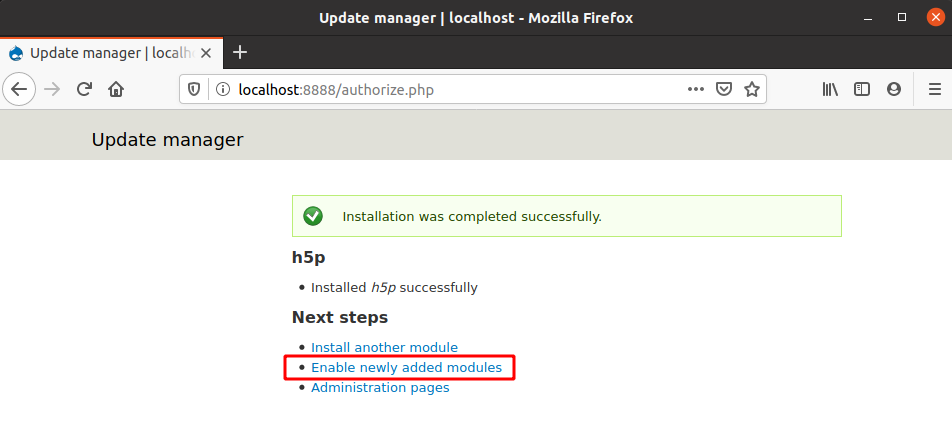
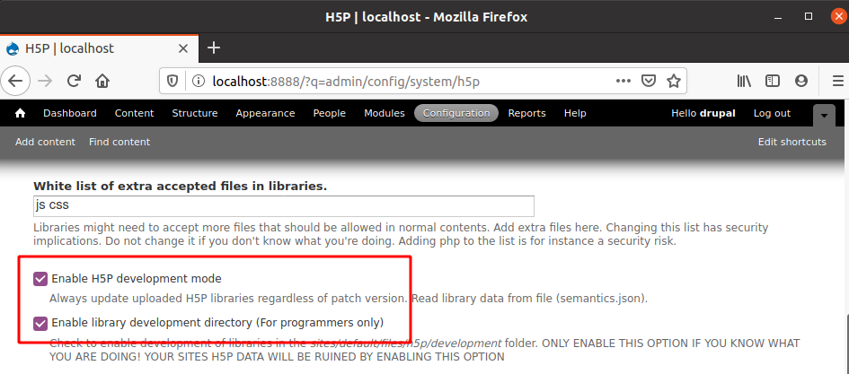
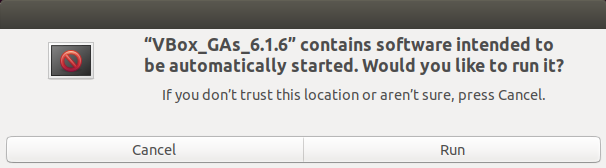

# H5P Content Type Development Environment with a VirtualBox guest VM

## Introduction

This article provides detailed instructions for setting up a development environment for H5P Content Types by using VirtualBox and a Virtual Machine running Ubuntu. We will create a brand new VM and install Ubuntu 18.04, and then add Apache, MySQL, PHP and finally Drupal 7 with the H5P plugin. We'll also see how we can configure port forwarding and shared folders so that we can use our favorite editor and browser straight from our primary (host) environment.

You should be able to follow these instructions on any system that can run VirtualBox.

Let's get started.

## Download and install VirtualBox

Download the latest version of VirtualBox from the official website: https://www.virtualbox.org/. There are installation instructions for all supported OSes.

## Download Ubuntu installation image

Download the desktop image for Ubuntu 18.04.4 LTS from http://releases.ubuntu.com/18.04.4

> The reason for using Ubuntu 18.04 even after 20.04 is already out is due to Drupal 7 and compatibility concerns with the default packages (mysql-server). You are of course free to choose the server image instead, but the article will assume you have a desktop environment.

### Creating a new VM in VirtualBox

Create a new VM. Default settings are mostly fine, but you might want to increase the disk size to something more than the default 10GB. Everything else can easily be modified after. Start the VM and then mount the installation image for Ubuntu you just downloaded in the previous step. Install Ubuntu and reboot as necessary.

> I believe the VirtualBox GUI is so simple that even if you haven't used it before you can probably figure out what to do. You can learn all there is to know (and more) about creating VMs in VirtualBox from the official documentation: https://www.virtualbox.org/manual/ch01.html#gui-createvm

Upon successful installation, a reboot and logging back in, make sure the system is up-to-date by executing the following commands in a terminal:

```bash
sudo apt update
sudo apt upgrade
```

At this point we are ready to install all the software we need.

## Installing Apache

```bash
sudo apt install apache2
```

## MySQL and creating a user and database for Drupal

```bash
sudo apt install mysql-server
```

> I recommend executing `mysql_secure_installation` after installing which will guide you through changing some defaults that will dramatically improve the security of your database installation. This is entirely optional, but I really think you should have a good reason for NOT doing it.

Connect to the MySQL server

```bash
sudo mysql
```

and create a new database and a new user (this is needed later when we install Drupal). You are free to come up with a more secure password than 'password' (and you might even be forced to if you did the mysql_secure_installation procedure and activated password validation).

```
create database drupal character set utf8mb4 collate utf8mb4_general_ci;
create user drupal@localhost identified by 'password';
grant all on drupal.* to drupal@localhost;
```

Disconnect from the database by sending EOF (Ctrl+D) or by typing exit or quit.

>Verify that you can connect with the user you just created by executing `mysql -u drupal -p` and then type the password when prompted. If you're able to connect and execute `show tables;` you should see the drupal database.

## Installing PHP and extensions

Install PHP and a set of extensions that Drupal 7 expects

```bash
sudo apt install php php-mysql php-gd php-mbstring php-xml php-zip
```

You can confirm that php has been installed by running `php -v`. You should see version 7.2.*

## Configuring PHP for Drupal 7 and H5P development

We need to increase some size limits in Apache's default php.ini. We do this by editing the `/etc/php/7.2/apache/php.ini` file and changing the following two values to 128M.

```
upload_max_filesize = 128M
```

and

```
post_max_size = 128M
```

## Restart Apache
We've installed new apache modules (automatically added as part of installing php) and also changed Apache's php configuration, so we must restart Apache for these changes to take effect

```bash 
sudo service apache2 restart
```

## Downloading Drupal 7

We are simply going to use the default site already preconfigured with Apache, so we download Drupal and extract to `/var/www/html/`.

> Find the latest version of Drupal 7 by visiting this page: https://www.drupal.org/project/drupal/releases?version=7 and modify the commands below accordingly.

```bash
cd /var/www/html
sudo rm index.html
sudo apt install wget
sudo wget https://ftp.drupal.org/files/projects/drupal-7.71.tar.gz
sudo tar -xvzf drupal-7.71.tar.gz
sudo mv drupal-7.71/* drupal-7.71/.htaccess drupal-7.71/.gitignore ./
sudo cp /var/www/html/sites/default/default.settings.php /var/www/html/sites/default/settings.php
sudo rm drupal-7.71.tar.gz
```

We now need to grant the www-data user ownership of the folder structure so that it can read and modify content as needed.

```bash
sudo chown -R www-data ./
```

## VirtualBox Machine port forwarding

Before proceeding, we will configure port forwarding so that we can access the Drupal site straight from our host OS. With the guest VM window active, press <kbd>right ctrl</kbd> + <kbd>s</kbd> to open machine settings. Open the Network tab, expand Advanced and click Port forwarding.


Create a new rule to forward host port 8888 to guest port 80. This means that traffic sent to port 8888 on your host machine will be forwarded to the guest. These port forwarding settings of the VirtualBox VM can be changed at any time, while running.


The drupal site is now available at http://localhost:8888 on your host machine. You can still access it at port 80 from within your guest VM, if you need to.

## Installing Drupal 7

We can now visit our Drupal site and perform the installation right from the browser. The installation wizard is self-explanatory. If we did everything right up until now this should be a quick process. If something went wrong, double check that you followed all the steps.


## Downloading and installing the H5P plugin

Find the URL to the most recent H5P plugin at the bottom of the following page: https://www.drupal.org/project/h5p and copy it to your clipboard.

As of June 17 2020 the latest module can be found at https://ftp.drupal.org/files/projects/h5p-7.x-1.46.tar.gz

The module can be installed through the Drupal admin interface by navigating to Modules > Install new module


Provide the URL to the module and install. If your network configuration prevents this, you have the option of uploading the file manually.



Upon successful installation, follow the link to be taken directly to modules page to enable it. You'll find it at the bottom. Enable both H5P and H5P Editor and save.


## Enabling H5P development folder

Navigate to Configuration > H5P to enable development mode as well as the development folder.



## Configure VirtualBox VM shared folder to work seamlessly from host OS

### Prerequisite: installing VirtualBox Guest Additions

We have to install VirtualBox Guest Additions in order to use the Shared Folders feature. For this we must first install some packages to enable building external kernel modules.

```bash
sudo apt update
sudo apt install build-essential dkms linux-headers-$(uname -r)
```

With that done, we insert the Guest Additions media from the Devices menu on the toolbar of the VirtualBox window of our guest and then run it.



> If you're using Ubuntu Server instead of Desktop, see the following article for instructions on how to mount: https://linuxize.com/post/how-to-install-virtualbox-guest-additions-in-ubuntu/

### Setting up a persistent shared folder between host and guest

Open the VM settings again by pressing <kbd>right ctrl</kbd> + <kbd>s</kbd>, and then open the Shared Folders tab.


Locate an existing folder on your host OS that you want to share with the VM. The mount point is the path within the VM where this folder will be made available. We want to make this permanent.


After doing this, we must grant our self and www-data permission to the folder within the VM, and we do this by adding both to the *vboxsf* group.

```bash
sudo adduser $USER vboxsf
sudo adduser www-data vboxsf
```

And finally, we need to log out and back in to access the folder.

## Creating a minimal h5p content type

We are almost ready to start coding, I promise. Let's just create a working directory for our content type.

We'll get a head start on the [H5P Hello World tutorial](https://h5p.org/tutorial-greeting-card) by creating the folder itself and then creating a symbolic link to it in the h5p development folder of our drupal site.

```bash
cd /mnt/h5pdev2 && mkdir h5p-greeting-card
cd /var/www/html/sites/default/files/h5p/development
sudo ln -s /mnt/h5pdev2/h5p-greeting-card ./h5p-greeting-card
```

That's it! Now we can just leave our VM running and use our host OS to edit the project files in the folder we shared.
